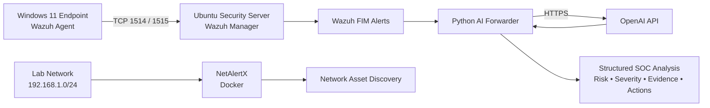
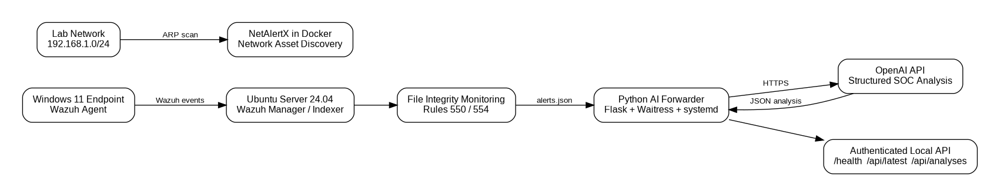
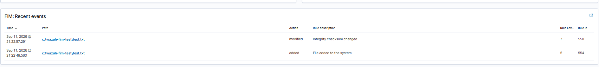
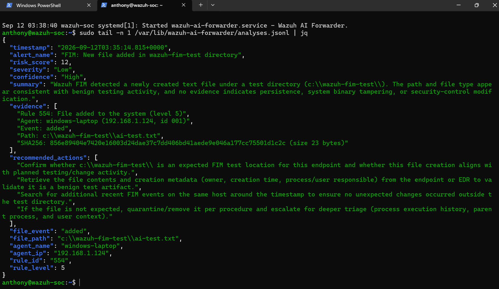
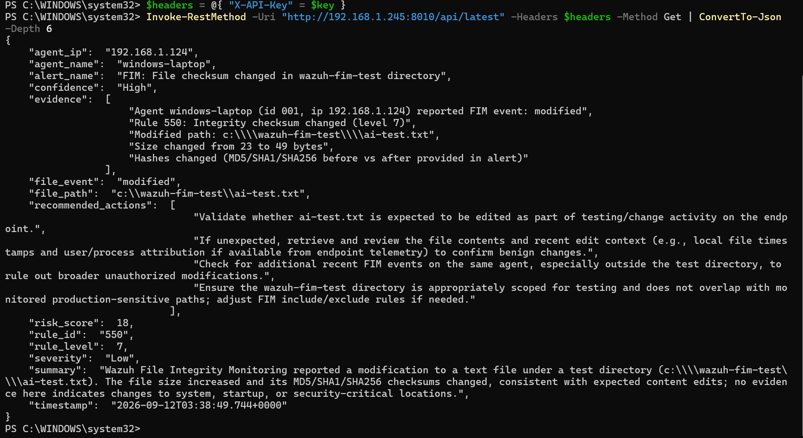
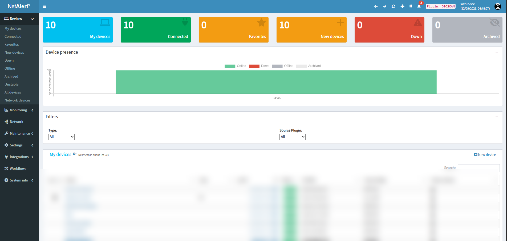

# 🛡️ Wazuh AI-Enhanced SOC Lab

**Wazuh • Python • OpenAI • Docker • NetAlertX • Ubuntu • Windows**

A hands-on Security Operations Center (SOC) lab that monitors a Windows endpoint with Wazuh, discovers devices on a lab network with NetAlertX, and uses a custom Python service with the OpenAI API to turn File Integrity Monitoring (FIM) alerts into structured SOC analysis.

## Project Highlights

- Monitored a Windows 11 endpoint using a Wazuh agent
- Configured real-time File Integrity Monitoring (FIM)
- Detected file creation and modification events
- Deployed NetAlertX in Docker for network asset discovery
- Built a Python service that reads Wazuh alerts and sends relevant FIM events to OpenAI
- Returned structured risk score, severity, confidence, evidence, and recommended actions
- Secured the local analysis API with API-key authentication
- Ran the Python integration as a persistent Linux `systemd` service

## Architecture





### Lab Environment

| Component | Role |
|---|---|
| Windows 11 | Monitored endpoint |
| Ubuntu Server 24.04 LTS | Wazuh server and AI-forwarder host |
| VMware Workstation | Virtualization |
| Wazuh 4.14.7 | SIEM/XDR and FIM |
| NetAlertX | Network asset discovery |
| Docker | NetAlertX container runtime |
| Python / Flask / Waitress | AI-forwarder and local REST API |
| OpenAI API | Structured security-event analysis |
| UFW | Host firewall |

---

## 🔎 Detection in Action

I configured the Wazuh Windows agent to monitor:

```text
C:\Wazuh-FIM-Test
```

The lab successfully detected both file creation and modification activity.

- **Rule 554:** File added to the system
- **Rule 550:** Integrity checksum changed



This validated the path from the Windows endpoint to the Wazuh manager and confirmed that real-time FIM events were being generated.

---

## 🤖 AI-Assisted SOC Analysis

I built a Python service that monitors Wazuh's JSON alert stream and processes relevant FIM events.

The service:

1. Reads Wazuh alerts from `alerts.json`
2. Filters for File Integrity Monitoring events
3. Extracts only the security metadata needed for analysis
4. Sends the event to the OpenAI Responses API
5. Validates the structured JSON response
6. Stores the result locally
7. Exposes the latest analysis through an authenticated REST API

The resulting analysis includes:

```json
{
  "alert_name": "File Integrity Monitoring Alert",
  "risk_score": 18,
  "severity": "Low",
  "confidence": "High",
  "summary": "Analyst-readable explanation of the event",
  "evidence": [],
  "recommended_actions": []
}
```

### Successful Analysis



The end-to-end test successfully processed both a file-add event and a later file-modification event.

The latest structured result was also retrieved from the authenticated local API:



---

## 🌐 Network Asset Discovery

NetAlertX was deployed in Docker using host networking to discover systems on the lab's `192.168.1.0/24` network.

The deployment used:

- Persistent Docker storage
- Host networking
- `NET_RAW`
- `NET_ADMIN`
- `NET_BIND_SERVICE`
- Bearer-token API authentication

NetAlertX successfully discovered the Windows endpoint, Ubuntu security server, and other devices on the lab network.

The sanitized Docker configuration is available in [`config/netalertx-compose.example.yml`](config/netalertx-compose.example.yml).



*Device-table details are intentionally blurred in the public screenshot to avoid exposing household device names and MAC addresses.*

---

## 🔐 Security Controls

The project was designed so credentials are not hard-coded into source code.

Key controls include:

- Dedicated unprivileged `wazuh-ai` Linux service account
- Root-owned environment file for secrets
- API-key authentication on `/api/*`
- UFW rules restricting lab services
- File contents/diffs excluded from the AI payload
- Wazuh event fields treated as untrusted input
- `.gitignore` protection for environment files, keys, runtime data, and credentials
- OpenAI API requests configured with `store: false`

See [`docs/security.md`](docs/security.md) for additional details.

---

## 🧪 Testing

The following tests were completed successfully:

| Test | Result |
|---|---|
| Windows Wazuh agent enrollment | ✅ Passed |
| Wazuh agent active/connected | ✅ Passed |
| FIM file creation detection | ✅ Passed |
| FIM file modification detection | ✅ Passed |
| NetAlertX network discovery | ✅ Passed |
| NetAlertX authenticated API request | ✅ Passed |
| AI-forwarder service health | ✅ Passed |
| Wazuh → Python → OpenAI analysis | ✅ Passed |
| Authenticated `/api/latest` request | ✅ Passed |

Detailed test procedures are available in [`docs/testing.md`](docs/testing.md).

---

## 🧩 Repository Structure

```text
Wazuh-AI-SOC-Lab/
├── README.md
├── screenshots/
│   ├── 01-wazuh-fim-detection.png
│   ├── 02-netalertx-discovery.png
│   ├── 03-ai-soc-analysis.png
│   └── 04-ai-api-response.png
├── src/
│   └── wazuh_ai_forwarder.py
├── config/
│   ├── wazuh-fim-config.xml
│   ├── netalertx-compose.example.yml
│   ├── wazuh-ai-forwarder.service
│   └── example.env
├── architecture/
│   ├── architecture-diagram.png
│   └── architecture.dot
├── docs/
│   ├── implementation.md
│   ├── testing.md
│   ├── security.md
│   ├── troubleshooting.md
│   └── resume-and-interview.md
├── requirements.txt
├── .gitignore
└── LICENSE
```

## 🛠️ Challenges & Troubleshooting

Building the lab required troubleshooting several real infrastructure issues:

- Rebuilt the VM using Ubuntu Server 24.04 LTS for Wazuh compatibility
- Expanded Linux storage after the Wazuh environment exhausted available disk space
- Corrected UFW rules preventing Wazuh agent communication
- Fixed NetAlertX container restart issues by adding the required Linux capabilities
- Corrected NetAlertX API authentication after receiving HTTP 403 responses
- Diagnosed an OpenAI HTTP 429 API-credit error before completing the AI test
- Used SSH from Windows PowerShell to simplify Ubuntu administration

These troubleshooting steps are documented in [`docs/troubleshooting.md`](docs/troubleshooting.md).

---

## 📚 Skills Demonstrated

`SIEM` · `Wazuh` · `File Integrity Monitoring` · `Linux` · `Windows` · `Python` · `REST APIs` · `Docker` · `systemd` · `UFW` · `SSH` · `Network Discovery` · `JSON` · `OpenAI API` · `Security Automation` · `Troubleshooting`

## Future Improvements

- Complete a Grafana visualization dashboard
- Add HTTPS to the local analysis API
- Add automated unit and integration tests
- Add log rotation and longer-term analysis retention
- Expand the pipeline to authentication and other Wazuh alert categories

## Public Repository Note

The source and configuration files in this repository are sanitized portfolio versions of the lab implementation. Secrets and runtime data are intentionally excluded, while the architecture, service behavior, endpoints, dependencies, and tested workflow match the completed lab.

## Author

**Anthony Alston**

Information Technology and Systems student building hands-on cybersecurity projects focused on security monitoring, networking, threat detection, and automation.

> This project was built for educational purposes in a private home-lab environment. No credentials, API keys, or private keys are included in this repository.
